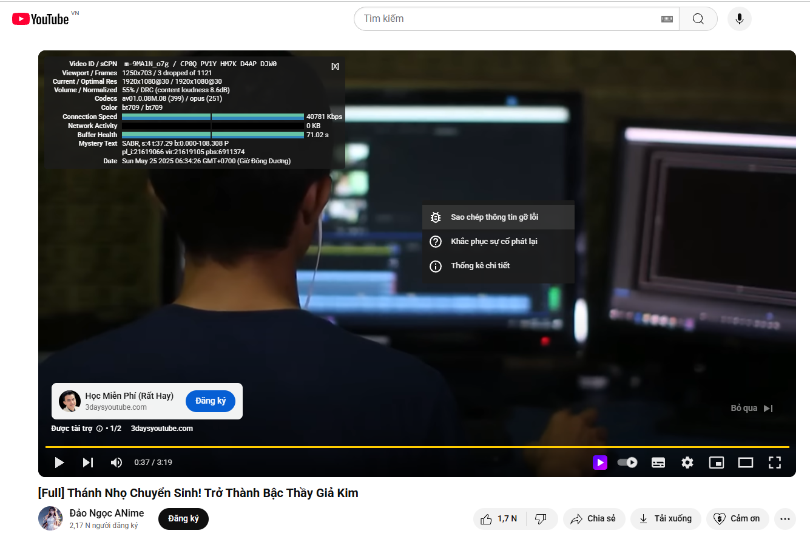

# 🔎 Phân Tích Debug YouTube

Công cụ web hiện đại giúp bạn **phân tích thông tin từ JSON debug của YouTube** (thường lấy từ chức năng “Sao chép thông tin gỡ lỗi”). Ứng dụng giúp bạn nhanh chóng trích xuất các đường link như video chính, quảng cáo, kênh, thumbnail và các thông tin nâng cao khác.



## 🚀 Tính Năng

- ✅ Nhập nội dung "sao chép thông tin gỡ lỗi" từ YouTube và phân tích tự động.
- ✅ Hiển thị 8 thông tin quan trọng: link video, quảng cáo, kênh, thumbnail, tracking, hiệu suất...
- ✅ Giao diện hiện đại, responsive trên mọi thiết bị.
- 🌙 **Chế độ Dark Mode** chuyển đổi dễ dàng.
- 💾 **Lưu lịch sử phân tích gần đây** bằng `localStorage`, chọn nhanh từ dropdown.
- 📲 **PWA (Progressive Web App)**: Có thể cài như app trên điện thoại và desktop.
- ⚡ Không cần server, hoạt động hoàn toàn offline sau lần đầu tải.

---

## 🛠️ Công Nghệ Sử Dụng

- HTML5, CSS3 (Flexbox, Responsive)
- JavaScript Vanilla
- localStorage
- PWA (manifest.json + serviceWorker)

---

## 📥 Cài Đặt & Sử Dụng

### 1. Clone repository

```bash
git clone https://github.com/<username>/phan-tich-debug-youtube.git
cd phan-tich-debug-youtube


### 2. Chạy trực tiếp (Local)

Chạy bằng bất kỳ trình duyệt nào (khuyên dùng Chrome/Edge/Brave):

```bash
open index.html
```

Hoặc dùng một server tĩnh như:

```bash
npx serve .
```

### 3. Cài như ứng dụng (PWA)

* Mở trang web trong Chrome.
* Nhấn biểu tượng “Cài đặt” trên thanh địa chỉ.
* Ứng dụng sẽ hoạt động như app native, hỗ trợ offline.

---

## 🗂️ Cấu Trúc Thư Mục

```
📁 phan-tich-debug-youtube
├── index.html              # Giao diện chính
├── style.css               # Giao diện tùy biến (nếu tách riêng)
├── script.js               # Logic phân tích + lưu lịch sử
├── manifest.json           # Cấu hình PWA
├── service-worker.js       # Cache offline cho PWA
├── icon-192.png            # Icon chuẩn PWA
├── icon-512.png            # Icon chuẩn PWA
└── README.md               # File này
```

---

## 📌 Mục Đích Ứng Dụng

* Hỗ trợ nhà phát triển, nhà quảng cáo, người dùng kỹ thuật phân tích các vấn đề liên quan đến video YouTube.
* Tìm video gốc, link quảng cáo, tracking ad, channel hoặc thumbnail nhanh chóng mà không cần mở DevTools.

---

## 🔮 Hướng Phát Triển Tương Lai

* [ ] Lưu lịch sử lên IndexedDB thay vì localStorage.
* [ ] Cho phép export file kết quả (.txt hoặc .json).
* [ ] Tự động bắt các chuỗi JSON từ clipboard nếu người dùng dán nhanh.
* [ ] Dịch đa ngôn ngữ (i18n: EN/VI/JP...).
* [ ] Tích hợp AI giải thích ý nghĩa các trường JSON debug.

---

## 📸 Demo Online

👉 [Xem bản demo](https://hoangthuan-dev.github.io/Youtube-Debug-Analyzer/)

---

## 📜 Giấy Phép

MIT License © 2025 [HoangThuanDev](https://github.com/hoangthuan-dev)

---

## 🙌 Góp ý & Liên hệ

Nếu bạn thấy công cụ hữu ích hoặc muốn đóng góp thêm, vui lòng gửi pull request hoặc tạo issue nhé!

📧 Email: [hoangthuan.dev+github.gopy@gmail.com](mailto:hoangthuan.dev+github.gopy@gmail.com)
🌐 Website: [hoangthuan.dev](https://hoangthuan.dev)


-----

